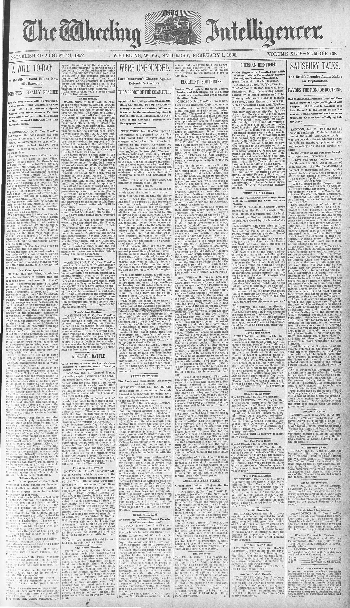

_Transcribed by [@jonathansampson][twitter], from [newspapers.com][source]._

# The Intelligencer
## WHEELING, FEBRUARY 1, 1896

ELOQUENT SOTHRONS,

**Booker Washington, the Great Colored Leader, and Col. Skaggs on the Living Questions at the Banquet of the Chicago Hamilton Club.**

CHICAGO, Jan 31.—The annual banquet of the Hamilton Club in commemoration of the birth of Alexander Hamilton, was held at the Auditorium to-night. The great dining room of the hotel was decorated in a lavish manner for the occasion and fully 300 of the most prominent men in the city were present. Many notable men from other places were also at the board. President Samuel W. Allerton, of the club, acted at toastmaster. It had been expected that Governor Levi P. Morton, of New York, ex-Secretary of the Interior Noble, of Missouri, and Senator J. B. Foraker, of Ohio, would be present, but all three were unavoidable absent. Governor Asa S. Bushnell, of Ohio, responded to the toast of “Republican Ohio,” and Bishop Charles E. Cheny, of Chicago, to “The Patriot,” Prof. Booker T. Washington, of Alabama, spoke eloquently upon “Our New Citizen.”

“You of this generation owe it to the south, not less than to yourselves an unfulfilled duty. Surely, surely, if the negro with all that is behind him, can forget the past, you ought to rise above him in this regard. When the south is poor, you are poor; when the south is ignorant, you are ignorant; when the south commits crime, you commit crime; when the south prospers, you prosper. There is no power that can separate our destiny. Let us ascend, in this matter, above color or race or party or sectionalism into the duty of man to man, American to American, Christian to Christian.”

“Let the negro, north and south, do their duty with a new spirit and a new determination during this, the dawning of a new century and at the end of fifty years, a picture will be painted. What is it? A race dragged from its native lands in chains; 800 years of slavery; years of fratricidal war; thousands of lives laid down; freedom of slaves; reconstruction; blunders; bitterness between north and south. The south staggers under the burden; the north forgets the past and comes to the rescue; the negro in the midst teaching north and south patience, forbearance, long suffering, obedience to law, developing in intelligence, character and prosperity, skill and habits of industry; the north and south joining hands with the negro, take him whom they both wronged, help him, encourage him, stimulate him, in self-help give him the rights of man and in lifting up the negro lift themselves up in that atmosphere where there is a new north, a new south, a new citizen, a new republic.”

Hon. William H. Skaggs, president of the Southern and Western Industrial Association was warmly received when he rose to speak on “The Passing of the Solid South.” Mr. Skaggs reviewed the political events of the past thirty year and said among other things:

Nothing can check the passing of the solid south except the possible, but not probably, interference of the Republican party. The solid south has passed beyond the control of the Democratic party. The two factions of the Democratic party in the south are now engaged in a war to the death. The black flag has been raised and no quarter is given. Furnaces out of blast, cotton brought down below the cost of production and labor idle have made object lessons more impressive than all the arguments of the past thirty years. White man accusing white man of stealing his vote has done more to purify the ballet than any other election law that could be placed on the federal statute books. There is no prospect of the south changing from a solid Democratic to a solid Republican section. I hope it will not. Twenty years of a solid Republican south would doubtless be as dangerous to American institutions as twenty years of solid Democratic south. You may ask if, in the passing of the solid south, there is any improvement in the purity of the ballot. I answer emphatically yes. Ballot box stuffers have served their day.

But what of the negro? The problem is not yet solved. It will never be solved by negroes who came to a Republican national convention for a price. It will never be solved by that class of white Republicans of the south who have no aim beyond the control of federal patronage, nor by that class of white Democrats who have no nobler purpose than to keep the negro in ignorance and poverty in order that the negro may still be his slave in fact, if not in name.

From the old slave quarters of our old plantation God has brought forth a Moses who will lead his people out. I rejoice that the managers of the Atlanta exposition had the foresight to bring forward this patriot, and teacher of his people. I rejoice that you good people of the north have received him well. I pray God for the sake of my people and the sake of his people that no designing politician will ever gain his confidence and the well merited admiration of a nation will not turn his course. God speed the noble work of Booker Washington. He has done more for his race than all the Republican officeholders of the south have ever done.
The passing of the solid south is upon us. But its significance is not sectional; it is national. It means that all the people are the conservators of the union and that this whole country has entered upon an era of a greater and a broader civilization, against which no foreign power shall ever prevail.

[twitter]: https://twitter.com/jonathansampson
[source]: https://www.newspapers.com/image/171164854/
