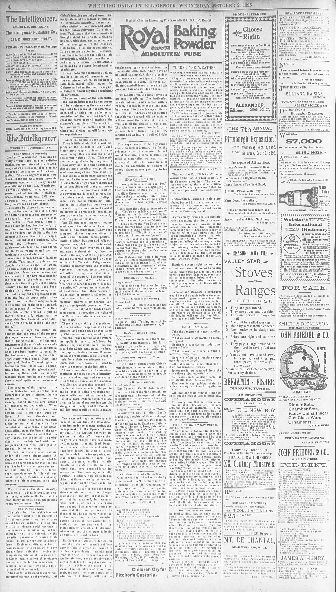

# The Intelligencer
## WHEELING, OCTOBER 2, 1895

_Transcribed by [@jonathansampson][twitter], from [newspapers.com][source]_

### The Negro's Opportunity.

Booker T. Washington, who has recently sprung into fame as a distinguished representative of the colored race, and who is spoken of as a splendid type of the progressive Afro-American—or, "the new negro", as he is now called—is the subject of many favorable newspaper comments. It may not be generally known that Mr. Washington is a West Virginian, having spent the greater part of his life in Madison, Boone country, where, until 1871, when he went to Hampton to seek an education, he worked as a day laborer.

It is stated by those who write about him that there is no man of his race who better represents the progress of the negro in the past thirty years than does Booker T. Washington. Born in 1857 a slave, he has, inspired only by ambition, risen to a very high position, and is now devoting his life to the betterment of the condition of his people. He is president of the Tuskegee, Ala., Normal and Industrial Institute, the existence of which is due to his efforts, and in which young colored men are receiving a practical education.

What has served, however, lately to bring Mr. Washington to public attention, is the Atlanta exposition, where by a single speech on the opening day, he acquired fame as an orator and as an apostle of the new movement for the progress of the colored race, and since which time  the press of the whole country and the people have been singing his praises. The young man had before enjoyed a reputation more than local, but his opportunity to impress himself on the country came on the opening day of the exposition, and, in the language of the New York Herald's tribute, "he grasped it, just as Henry Grady did, when at the memorable New England Society dinner at New York, he spoke of the new south."

His coming, says one writer, announces that the sway of the progressive negro has come to take the place of that of the politician. Until the present, negroes of the south who were working to benefit their race on industrial lines have been content to remain in the back-ground, believing that their opportunity would come. Now it has come, and Booker T. Washington is leading the van. He believes in a practical education for the colored youth, in teaching them trades, and in only teaching them professions when they show special aptitude for professional careers.

The progress of the negroes in the United States has been one of the most remarkable things in history. Only a generation ago they were in slavery, bound in the very depths of ignorance and degradation. When it is considered what they have accomplished since they were relieved of their shackles and made to feel that they were a race with a destiny, and what they will still accomplish as they advance in education and civilization on the lines of the new movement, it is safe to predict that the day that will see the last of the prejudice which as interfered with their progress and their political rights in the south is not far distant.

No race has made greater progress under the same circumstances. A single generation was not expected to place the negroes on a par with the race that has had many centuries the start of them, but, all things considered, they have done wonderfully well, and Washington, Bruce, Langston and many others are fair representatives of this progress.

[twitter]: https://twitter.com/jonathansampson
[source]: https://www.newspapers.com/image/171212333/
